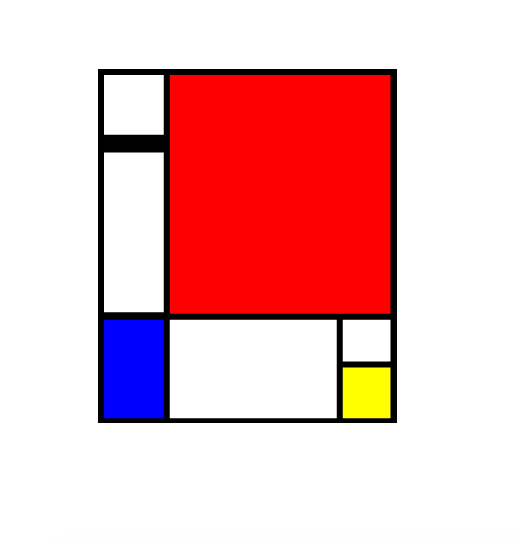

Second Project - Mondriaan 🎨
---



### Installation

Download `zip` file or use `git`.

```
git clone https://github.com/project42da/p5_mondriaan.git
```

then run `SimpleHTTPServer`.

```
python -m SimpleHTTPServer 8000
```

### Library
- [p5.js](https://p5js.org)